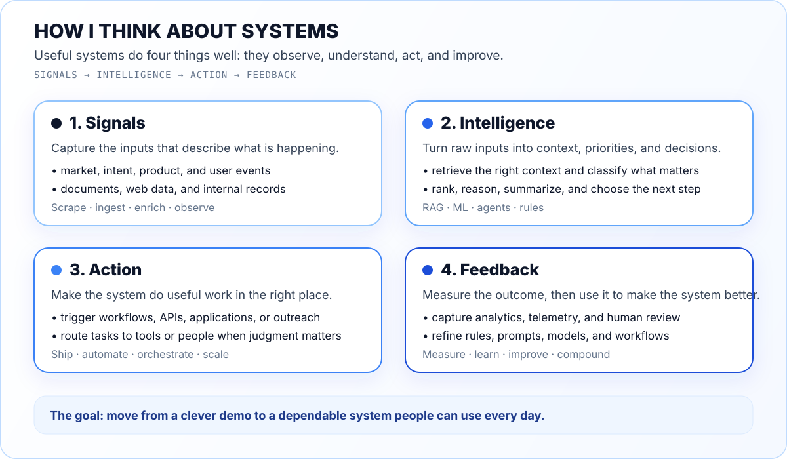
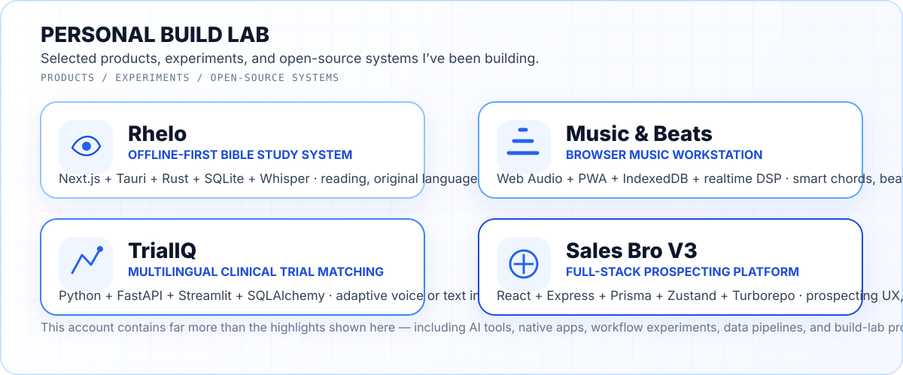

<div align="center">
  

  <br/>

  <a href="https://eagleeyesystems.in/"></a>
  <a href="https://rhelobible.com"></a>
  <a href="https://jedix420.github.io/musicandbeats/"></a>
  <a href="mailto:jay@eagleeyesystems.in"></a>

  <br/><br/>

  
</div>

---

## Founder mode: Eagle Eye Systems

<table>
<tr>
<td width="155" align="center" valign="middle">
  <a href="https://eagleeyesystems.in/">
    
  </a>
</td>
<td valign="middle">
  <strong>I’m the Founder & CEO of <a href="https://eagleeyesystems.in/">Eagle Eye Systems</a></strong> — an AI engineering company focused on enterprise AI infrastructure, autonomous GTM systems, and high-performance digital products.
  <br/><br/>
  We build private intelligence layers, semantic retrieval systems, agentic workflows, signal-mapping and enrichment pipelines, automation infrastructure, and premium web experiences for teams that want AI to become operational infrastructure rather than another disconnected tool.
</td>
</tr>
</table>



### What I spend most of my time building

- **Private AI + knowledge systems** — semantic RAG, internal search, document intelligence, local/private deployments and decision-support layers.
- **Agentic automation** — systems that observe signals, reason over context, trigger tools, route work and keep humans in the loop where judgment matters.
- **GTM engineering** — enrichment, intent/signal mapping, research pipelines, outbound orchestration, reporting and workflow automation.
- **Full-stack products** — polished React/Next.js interfaces, APIs, data layers, native wrappers, cloud/edge deployments and the infrastructure around them.
- **Fast experimental systems** — I like compressing the distance between an idea and a working product, then hardening what proves useful.

> **The pattern I care about:** capture signal → turn it into intelligence → make the system act → measure the feedback → compound what works.

---

## Personal build lab

Outside Eagle Eye, GitHub is where I prototype products, interfaces, research tools and occasionally things I simply wish existed.



### Rhelo — offline-first Bible study, built like a serious research tool

<a href="https://github.com/JEDIx420/rhelo_desktop"></a>

**Rhelo** combines aligned English + original-language Scripture study with morphology, lexicons, cross-references, maps, research capture, offline speech, native PDF export and persistent study sessions. The desktop architecture uses **Next.js + Tauri + Rust + SQLite**, with native IPC instead of a localhost backend.

**Explore:** [Desktop](https://github.com/JEDIx420/rhelo_desktop) · [iOS](https://github.com/JEDIx420/rhelo_ios) · [Rhelo website](https://rhelobible.com)

<br/>

### Music & Beats — a browser workstation I wanted to exist

<a href="https://jedix420.github.io/musicandbeats/">
  
</a>

A local-first browser music workstation with **Smart Keys, an independently playable piano, bass instruments, guitar amp/pedal processing, beat generation, audio input, phase-aligned looping, timeline views and local projects**. It is designed as an actual playable interface across desktop and tablet rather than a desktop UI squeezed onto touchscreens.

**Try it:** [Live app](https://jedix420.github.io/musicandbeats/) · [Source](https://github.com/JEDIx420/musicandbeats)

<br/>

### A few more builds

| Project | What it explores | Stack / focus |
|---|---|---|
| **[TrialIQ](https://github.com/JEDIx420/TrialIQ)** | Multilingual, voice-enabled clinical-trial eligibility matching and geo-aware scoring | Python · FastAPI · Streamlit · SQLAlchemy |
| **[Sales Bro V3](https://github.com/JEDIx420/salesbro_v3)** | Full-stack prospecting platform and sales workflow UX | React · Express · Prisma · Zustand · Turborepo |
| **[n8n Workflows](https://github.com/JEDIx420/n8n-workflows)** | Automation patterns and reusable workflow experiments | n8n · APIs · webhooks · orchestration |
| **[Browser Automation](https://github.com/JEDIx420/browser-automation)** | Browser-driven automation and agentic interaction experiments | automation · agents · web tooling |
| **[Scraper Scrapy](https://github.com/JEDIx420/Scraper_Scrapy)** | Structured extraction and web-data pipelines | Python · Scrapy · data engineering |
| **[Realtime Agents](https://github.com/JEDIx420/realtime-agents)** | Low-latency conversational / agent interface experiments | realtime AI · voice · interaction |

There are **dozens more repositories** across AI, automation, native apps, web products, scraping, local models, workflow tooling and experiments. Some are original products, some are research/reference forks, and some are intentionally messy build-lab archaeology — because I learn fastest by making things run.

[**→ Browse all repositories**](https://github.com/JEDIx420?tab=repositories)

---

## Systems I’m strongest in

<div align="center">
  
</div>

<br/>

<div align="center">
  
  
  
  
  
</div>

### The skill stack behind the repos

**AI & intelligence**  
LLM application architecture · semantic RAG · tool-using agents · prompt/system design · retrieval pipelines · local-model experimentation · applied ML patterns

**Automation & GTM systems**  
n8n · webhooks · enrichment pipelines · research automation · signal detection · browser automation · scraping · workflow orchestration · reporting systems

**Product engineering**  
React · Next.js · TypeScript · Node.js · Python · Rust · Tauri · REST APIs · Web Audio · PWAs · responsive/touch-first UX

**Data & infrastructure**  
PostgreSQL · SQLite · Supabase · Prisma · Docker · Cloudflare · GitHub Actions · edge/serverless patterns · self-hosted systems

**How I work**  
Product thinking first. Fast prototypes when uncertainty is high. Strong interfaces because adoption matters. Automation wherever repeated human effort adds no value. Enough infrastructure to make the thing dependable — not infrastructure for its own sake.

---

## GitHub telemetry

<div align="center">
  
  
</div>


---

## Current coordinates

```text
company     Eagle Eye Systems
role        Founder & CEO
building    enterprise AI · agentic automation · GTM infrastructure
personal    Rhelo · Music & Beats · experimental product systems
bias        ship useful things > talk about useful things
mode        build → test → automate → scale
```

<div align="center">
  <h3>Building intelligence systems that move from demo → deployment → daily use.</h3>
  <p>
    <a href="https://eagleeyesystems.in/"><strong>eagleeyesystems.in</strong></a>
    &nbsp;·&nbsp;
    <a href="mailto:jay@eagleeyesystems.in"><strong>jay@eagleeyesystems.in</strong></a>
    &nbsp;·&nbsp;
    <a href="https://github.com/JEDIx420?tab=repositories"><strong>all repositories</strong></a>
  </p>
  <sub>Founder. Engineer. Product builder. Still shipping.</sub>
</div>
