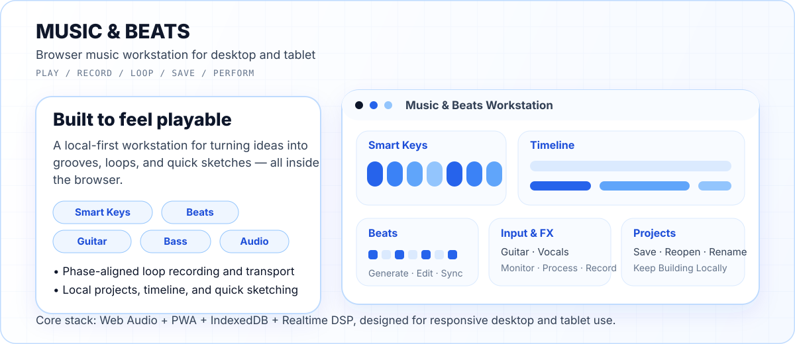

<div align="center">
  

  <p>
    <strong>Building AI systems that ship.</strong><br/>
    Founder &amp; CEO at Eagle Eye R&amp;D Labs · Enterprise AI · Agentic Automation · GTM Engineering · Product Engineering
  </p>

  <p>
    <a href="https://eagleeyesystems.in/"></a>
    <a href="https://rhelobible.com/"></a>
    <a href="https://jedix420.github.io/musicandbeats/"></a>
    <a href="mailto:jay@eagleeyesystems.in"></a>
  </p>
</div>

---

## Founder Mode: Eagle Eye R&D Labs

<table>
<tr>
<td width="155" align="center" valign="middle">
  <a href="https://eagleeyesystems.in/">
    
  </a>
</td>
<td valign="middle">
  <strong>I’m the Founder &amp; CEO of <a href="https://eagleeyesystems.in/">Eagle Eye R&amp;D Labs</a></strong> — an AI engineering company focused on enterprise AI infrastructure, autonomous GTM systems, and high-performance digital products.
  <br/><br/>
  We design private intelligence layers, semantic retrieval systems, agentic workflows, signal-mapping and enrichment pipelines, automation infrastructure, and premium web experiences for teams that want AI to become operational infrastructure rather than another disconnected tool.
  <br/><br/>
  <a href="https://eagleeyesystems.in/"><strong>Explore Eagle Eye R&amp;D Labs →</strong></a>
</td>
</tr>
</table>


### What I Spend Most of My Time Building

- **Private AI + knowledge systems** — semantic RAG, internal search, document intelligence, local or private deployments, and decision-support layers.
- **Agentic automation** — systems that observe signals, reason over context, trigger tools, route work, and keep humans in the loop where judgment matters.
- **GTM engineering** — enrichment, intent and signal mapping, research pipelines, outbound orchestration, reporting, and workflow automation.
- **Full-stack products** — polished React and Next.js interfaces, APIs, data layers, native wrappers, and cloud or edge deployments.
- **Fast experimental systems** — I like compressing the distance between an idea and a working product, then hardening what proves useful.

> **The pattern I care about:** observe signals → produce intelligence → trigger action → learn from feedback → compound what works.

---

## Personal Build Lab

Outside Eagle Eye, GitHub is where I prototype products, interfaces, research tools, and the occasional thing I simply wish existed.


### Rhelo — Offline-First Bible Study, Built as a Serious Research Environment

<a href="https://rhelobible.com/">
  
</a>

**Rhelo** is my offline-first Bible study environment for people who want to move naturally between reading and serious research. It brings together aligned English and original-language Scripture, morphology, lexicons, cross-references, maps, study capture, offline speech, native PDF export, and persistent study sessions.

Under the hood, the desktop application uses **Next.js + Tauri + Rust + SQLite**, with native IPC rather than a localhost backend. The goal is a fast, focused research workspace that remains useful even when the network disappears.

<div align="center">
  <a href="https://rhelobible.com/"></a>
  <a href="https://rhelobible.com/beta"></a>
  <a href="https://github.com/JEDIx420/rhelo_desktop"></a>
  <a href="https://github.com/JEDIx420/rhelo_ios"></a>
</div>

> **Want early access?** Visit **[rhelobible.com/beta](https://rhelobible.com/beta)** to apply as a beta tester and help shape the product as it evolves.

<br/>

### Music & Beats — A Browser Music Workstation for Desktop and Tablet

<a href="https://jedix420.github.io/musicandbeats/">
  
</a>

**Music &amp; Beats** is a local-first browser music workstation built for actual play, not just visual flair. It brings together Smart Keys, an independently playable piano, bass instruments, guitar amp and pedal processing, beat generation, audio input, phase-aligned looping, timeline views, and local projects.

It is designed as a responsive instrument and composition surface across desktop and tablet rather than a desktop UI squeezed onto touchscreens.

**Try it:** [Live app](https://jedix420.github.io/musicandbeats/) · [Source](https://github.com/JEDIx420/musicandbeats)

<br/>

### Selected Additional Builds

| Project | What it explores | Stack / focus |
|---|---|---|
| **[TrialIQ](https://github.com/JEDIx420/TrialIQ)** | Multilingual, voice-enabled clinical-trial eligibility matching and geo-aware scoring | Python · FastAPI · Streamlit · SQLAlchemy |
| **[Sales Bro V3](https://github.com/JEDIx420/salesbro_v3)** | Full-stack prospecting platform and sales workflow UX | React · Express · Prisma · Zustand · Turborepo |
| **[n8n Workflows](https://github.com/JEDIx420/n8n-workflows)** | Automation patterns and reusable workflow experiments | n8n · APIs · webhooks · orchestration |
| **[Browser Automation](https://github.com/JEDIx420/browser-automation)** | Browser-driven automation and agentic interaction experiments | automation · agents · web tooling |
| **[Scraper Scrapy](https://github.com/JEDIx420/Scraper_Scrapy)** | Structured extraction and web-data pipelines | Python · Scrapy · data engineering |
| **[Realtime Agents](https://github.com/JEDIx420/realtime-agents)** | Low-latency conversational and agent interface experiments | realtime AI · voice · interaction |

There are **dozens more repositories** across AI, automation, native apps, web products, scraping, local models, workflow tooling, and experiments. Some are original products, some are research or reference forks, and some are intentionally messy build-lab archaeology — because I learn fastest by making things run.

[**→ Browse all repositories**](https://github.com/JEDIx420?tab=repositories)

---

## Systems I’m Strongest In

<div align="center">
  
</div>

<br/>

<div align="center">
  
  
  
  
  
</div>

### The Skill Stack Behind the Repos

**AI & Intelligence**  
LLM application architecture · semantic RAG · tool-using agents · prompt and system design · retrieval pipelines · local-model experimentation · applied machine-learning patterns

**Automation & GTM Systems**  
n8n · webhooks · enrichment pipelines · research automation · signal detection · browser automation · scraping · workflow orchestration · reporting systems

**Product Engineering**  
React · Next.js · TypeScript · Node.js · Python · Rust · Tauri · REST APIs · Web Audio · PWAs · responsive, touch-first UX

**Data & Infrastructure**  
PostgreSQL · SQLite · Supabase · Prisma · Docker · Cloudflare · GitHub Actions · edge and serverless patterns · self-hosted systems

**How I Work**  
Product thinking first. Fast prototypes when uncertainty is high. Strong interfaces because adoption matters. Automation wherever repeated human effort adds no value. Enough infrastructure to make the thing dependable — not infrastructure for its own sake.

---

## Current Coordinates

```text
company     Eagle Eye R&D Labs
role        Founder & CEO
building    enterprise AI · agentic automation · GTM infrastructure
personal    Rhelo · Music & Beats · experimental product systems
bias        ship useful things > talk about useful things
mode        build → test → automate → scale
```

<div align="center">
  <h3>Building intelligence systems that move from demo → deployment → daily use.</h3>
  <p>
    <a href="https://eagleeyesystems.in/"><strong>eagleeyesystems.in</strong></a>
    &nbsp;·&nbsp;
    <a href="https://rhelobible.com/"><strong>rhelobible.com</strong></a>
    &nbsp;·&nbsp;
    <a href="mailto:jay@eagleeyesystems.in"><strong>jay@eagleeyesystems.in</strong></a>
    &nbsp;·&nbsp;
    <a href="https://github.com/JEDIx420?tab=repositories"><strong>all repositories</strong></a>
  </p>
  <sub>Founder. Engineer. Product builder. Still shipping.</sub>
</div>
